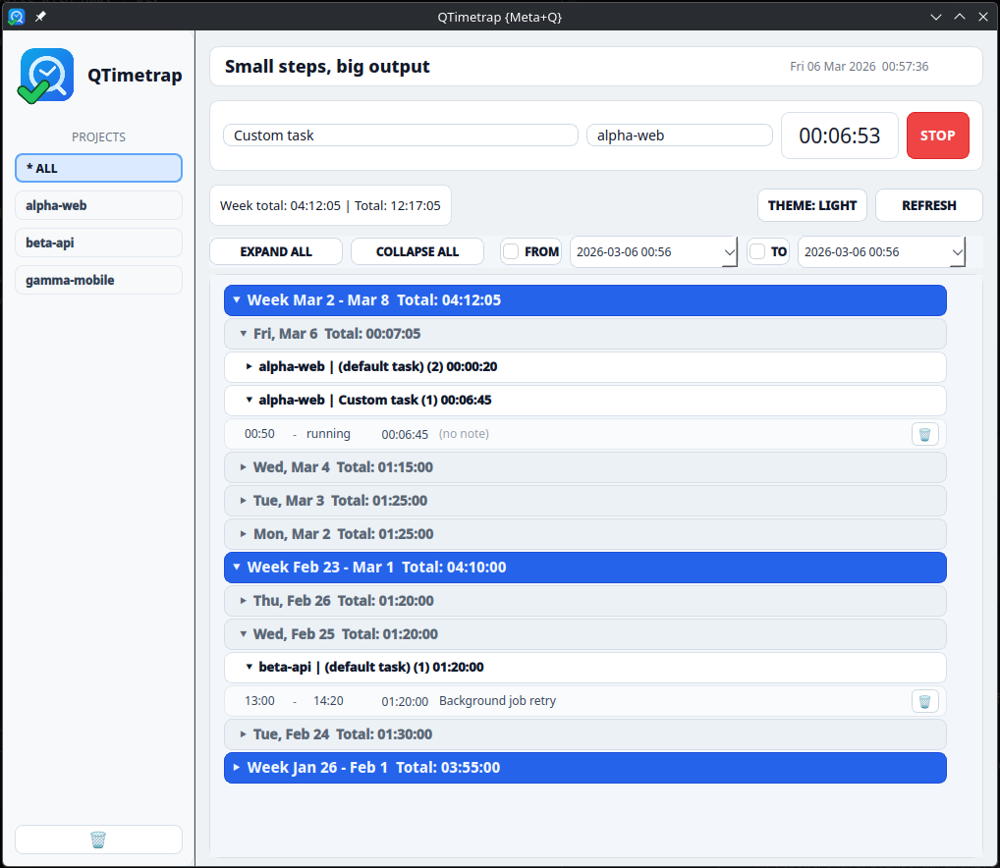

# QTimetrap

Desktop UI for [Timetrap](https://github.com/samg/timetrap), built with Ruby + Qt.

QTimetrap follows an MVVM-style architecture with `Zeitwerk` autoloading and a Rails-like project structure.



## Features

- Expandable entries tree: `week -> day -> project/task -> time entry`.
- Start/stop tracking from UI (single button based on running state).
- Edit entry `note`, `start`, and `end` directly in the list.
- Project/task sidebar with multi-select task filtering.
- Date-time interval filtering (`FROM`/`TO`) with live apply.
- Archive mode (soft-hide entries via local archive store, no destructive Timetrap delete).
- Theme switch (`light`/`dark`) with persistent selection.

## Requirements

- Ruby `>= 3.2`
- Qt bridge gem: `qt >= 0.1.0`
- `timetrap` CLI available as `t` (or configured via env)

## Install

### RubyGems

```bash
gem install qtimetrap timetrap
qtimetrap
```

Note: `qtimetrap` depends on the `qt` gem with native extensions.  
Install required system libraries first:
<https://github.com/CyJimmy264/qt?tab=readme-ov-file#system-requirements>.

### Fedora COPR

```bash
sudo dnf copr enable cyjimmy264/ruby-qt
sudo dnf copr enable cyjimmy264/ruby-qtimetrap
sudo dnf install ruby-qt ruby-qtimetrap
gem install timetrap
qtimetrap
```

## Run

```bash
bundle install
bundle exec bin/qtimetrap
```

If `qt` is already installed in your current `rbenv` shell, you can also run:

```bash
bin/qtimetrap
```

## Configuration

- `QTIMETRAP_ENV`: app environment (`development` by default)
- `TIMETRAP_BIN`: timetrap CLI command (`t` by default)
- `QTIMETRAP_THEME`: initial theme (`light` by default)
- `QTIMETRAP_RELOAD=1`: enable Zeitwerk reloading in development

Persisted settings:

- Theme: `~/.config/qtimetrap/config.yml`
- Archived entry ids: `~/.local/share/qtimetrap/archived_entries.yml`

(`$XDG_CONFIG_HOME` / `$XDG_DATA_HOME` are respected.)

## Development

```bash
rspec
gem build qtimetrap.gemspec
```

Main directories:

- `app/models`, `app/services`, `app/view_models`
- `app/views`, `app/components`
- `app/styles/themes/{light,dark}/*.qss`
- `config/`, `lib/`, `spec/`

## Packaging

- Fedora/COPR assets: `packaging/rpm`
- Debian/Launchpad assets: `packaging/deb`
